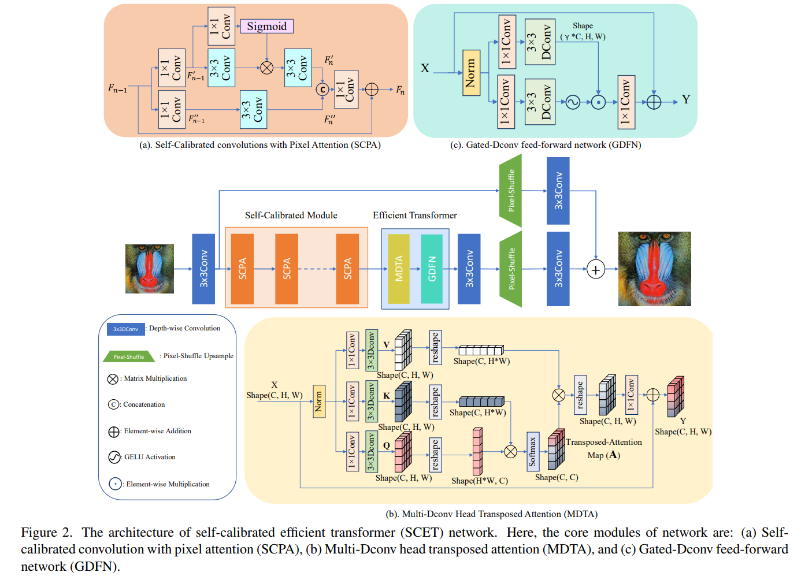

# Self-Calibrated Efficient Transformer for Lightweight Super-Resolution (offical)
## Introduction

We have implemented our SCET method through the [mmediting](https://github.com/open-mmlab/mmediting) and [mim](https://github.com/open-mmlab/mim) algorithm framework. Next, we will describe the main processes of training and testing.

- Paper The SCET has been accepted by CVPRW2022, you can read the [paper](https://arxiv.org/pdf/2204.08913.pdf) here.
- Model



## Datasets
We use DIV2K and Flickr2K as our training datasets. First, we need to crop our training set by cropping each image in the dataset to a 480x480 size patch.

## How to use the code to train SCET network.
1. Installation environment
```
conda create -n open-mmlab python=3.8 pytorch=1.10 cudatoolkit=11.3 torchvision -c pytorch -y
conda activate open-mmlab
pip3 install openmim
mim install mmedit
```

2. Modify the configuration file `configs/SCETx2.py` as follows:
```
# train
gt_folder='${dataset_workspace}/dataset/DF2K_train_HR_sub' # your train data path
lq_folder='${dataset_workspace}/dataset/DIV2K_train_LR_bicubic/X4_sub',
gt_folder='${dataset_workspace}/dataset/DF2K_train_HR_sub',
ann_file='${dataset_workspace}/dataset/meta_info.txt',
# Testing
lq_folder='${dataset_workspace}/dataset/validation/lr_x4' # your test data LR path
gt_folder='${dataset_workspace}/dataset/validation/gt' # your test data HR path
```
ps: Please refer to the [official mmediting instructions](https://mmediting.readthedocs.io/en/latest/_tmp/config.html) for specific instructions on the configuration file.

3. Modify the bash file `train.sh` as follows:
```
# modify the number of gpus, config path and outdir path.
PYTHONPATH=$PWD:$PYTHONPATH mim train mmedit ./config/SCETx2.py --gpus 1 --work-dir {Your save ckpt path}
```

4. train SCET network, as follows:
```
cd SCET

bash train.sh
```
## How to use the code to test SCET network.
1. Modify the bash file `test.sh` as follows:
```
# modify the config path, checkpoint path and outdir path.
PYTHONPATH=$PWD:$PYTHONPATH mim test mmedit ./config/SCET_x2.py --checkpoint ./weights/SCETx2.pth --save-path {Your save image path}
```
2. train SCET network, as follows:
```
cd SCET

bash test.sh
```
If you find this repo useful for your research, please consider citing the papers.
```
@article{zou2022self,
  title={Self-Calibrated Efficient Transformer for Lightweight Super-Resolution},
  author={Zou, Wenbin and Ye, Tian and Zheng, Weixin and Zhang, Yunchen and Chen, Liang and Wu, Yi},
  journal={arXiv preprint arXiv:2204.08913},
  year={2022}
}
```